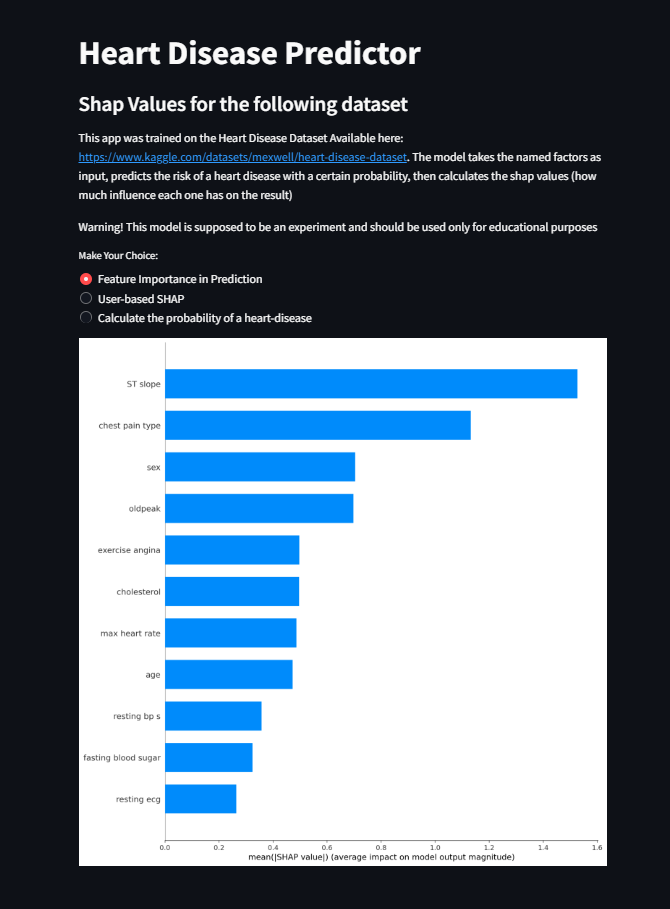
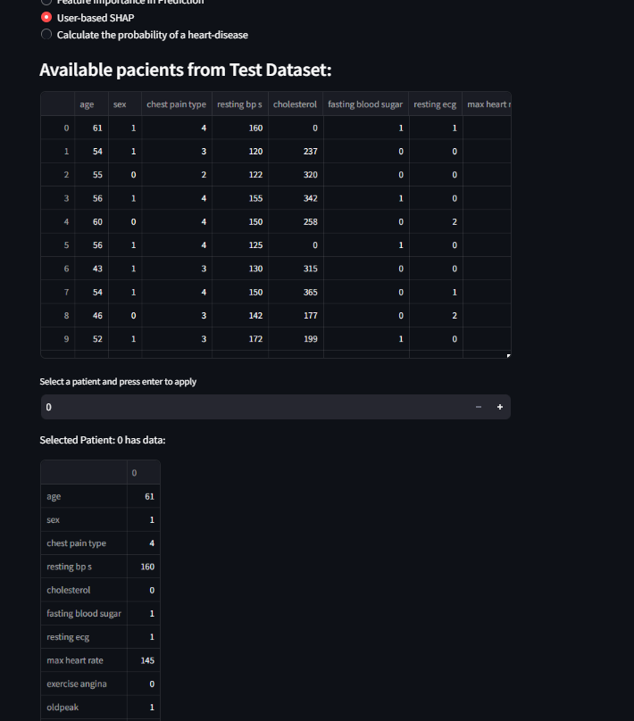
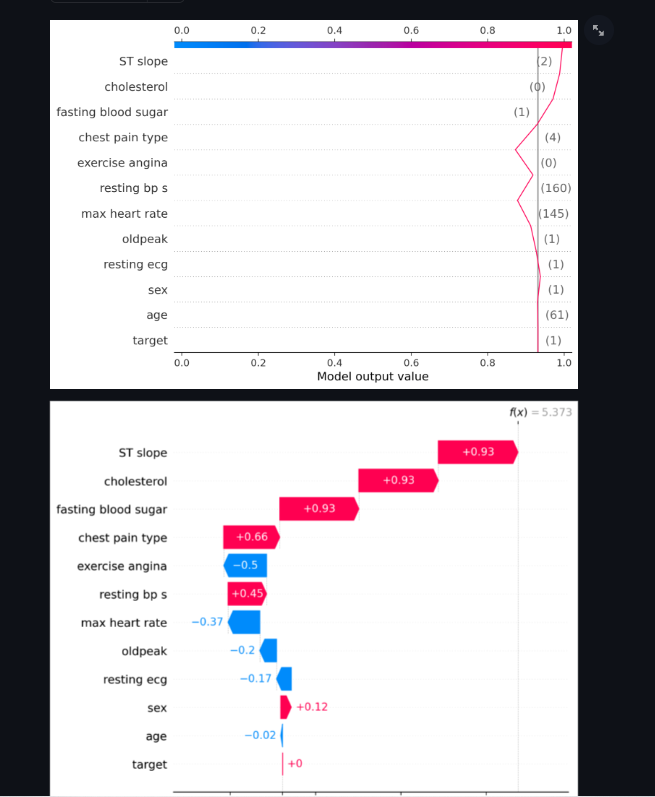
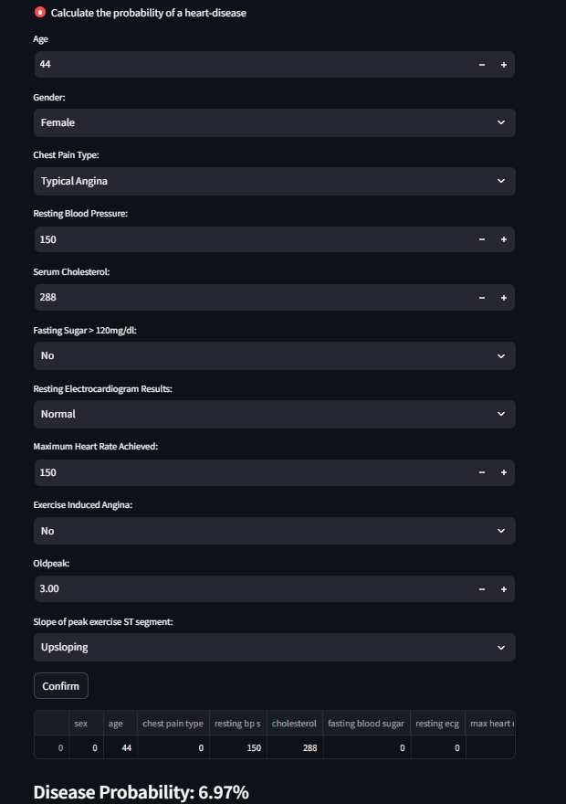

This is a ML project based on the Heart Disease Dataset available here: https://www.kaggle.com/datasets/mexwell/heart-disease-dataset

You can check it out here: https://lucianstefanandrei-heartdiseaseml-streamlit-app-npmkhw.streamlit.app/. Note that some browsers/antivirus/vpn might block it because it is hosted on streamlit, and these kind of apps can be seen as unsecure.

In order to run this project, simply open a terminal in the root folder and run *streamlit run streamlit-app.py*
This should open the app in the browser
Be sure to have all the requirement installed using *pip install -r requirements.txt*

In case you get an error, or the data is corrupted, run the Jupyter Notebook available as *main.ipynb* , which downloads the data, trains the model, and saves them in an appropiate format

